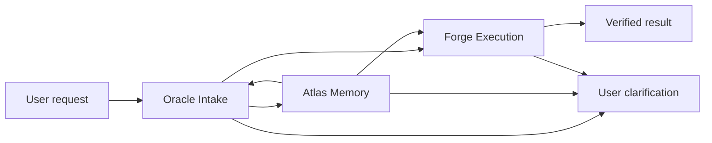

# Hermes Gateway Pack

This project defines five unique gateways and five domain agents for Hermes.

It also includes three profile-level council configurations under `profiles/`:

- Legal
- Trading
- Security Research
- Direct Mode

## Domain Agents

1. Hermes Legal Agent: legal intake, document review, issue spotting, and attorney-review drafts.
2. Hermes Options Trading Agent: options education, scenario analysis, risk checklists, and trade journaling.
3. Hermes Security Research Agent: authorized defensive security research, threat modeling, and remediation.
4. Hermes Solopreneur Agent: offer design, operating cadence, workflows, and founder execution.
5. Hermes Marketing Agent: campaigns, messaging, content, lifecycle, performance, and claim review.

The shared agent manifest is in `agents/hermes_agents.json`.

## Gateways

1. Oracle Intake Gateway: captures intent, classifies risk, and creates a task brief.
2. Forge Execution Gateway: performs scoped local implementation and verification.
3. Atlas Memory Gateway: retrieves project context and source-backed facts.
4. Model Provider Gateway: routes agents to approved model providers without bypassing API keys, subscriptions, rate limits, or access controls.
5. Bridge API Gateway: maps router decisions to documented Hermes HTTP/SSE endpoints for native clients and local controllers.
6. JARVIS Tool Armory: approval-gated Gmail, Calendar, Drive, read-only GitHub,
   browser harness, and optional MCP tools behind a local HUD.

The shared routing manifest is in `gateways/hermes_gateways.json`.

## Suggested Flow



## Dynamic Router

`src/system/dynamic-router.sh` converts a user request into profile, intent, skills, model-provider route, access method, and thinking level metadata. It is sourceable from other scripts and executable for inspection.

```bash
src/system/dynamic-router.sh --evaluate "review this vendor contract" legal
src/system/dynamic-router.sh --json "analyze an options spread" trading
src/system/dynamic-router.sh --report security "threat model my owned API"
```

The router follows the provider policy in `gateways/model_providers.json`: official APIs, approved connectors, local runtimes, or manual handoff only.

Cost controls live in `config/cost-policy.json`: 20-message history caps, profile-scoped skill budgets, cheap background routing, and 10-15 minute heartbeat intervals.

Run `src/system/cost-audit.sh` to verify the cost policy and preview how a background heartbeat routes.

## Hermes Dispatch

Use `src/system/hermes-dispatch.sh` as the normal front door. It keeps skill
selection automatic through the dynamic skill engine, loads the active cloud
model picker selection, accepts manual thinking/model overrides, and prints the
model/skill/thinking footnote.

```bash
src/system/hermes-dispatch.sh "fix this failing test"
src/system/hermes-dispatch.sh --thinking high "debug this issue"
src/system/hermes-dispatch.sh --project amazon-appeal "red team this appeal filing"
src/system/hermes-dispatch.sh --model-key nvidia-nim --model-id meta/llama-3.3-70b-instruct "use this model"
```

Daily refresh:

```bash
src/system/daily-refresh.sh
```

## Hermes Max Power Setup

The current strongest local setup is documented in
`docs/hermes-max-power-setup.md` and summarized by
`config/hermes-power-setup.json`.

JARVIS setup is documented in `docs/jarvis-armory-integration.md`; the local
config template is `config/jarvis-armory.config.local.example.json`.

Promptfoo dynamic-prompt evals are documented in `docs/promptfoo-evals.md`.

Use the power-up front door when you want the full stack checked together:

```bash
src/system/hermes-power-up.sh status
src/system/hermes-power-up.sh refresh
src/system/hermes-power-up.sh verify
src/system/hermes-power-up.sh all
```

Quick model switching:

```bash
src/system/model.sh
src/system/model.sh onith
src/system/model.sh glm
src/system/model.sh receipt
```

JARVIS Tool Armory:

```bash
src/system/jarvis-armory.sh status
src/system/jarvis-armory.sh verify-artifacts
src/system/jarvis-armory.sh install
src/system/jarvis-armory.sh start
src/system/jarvis-armory.sh doctor
```

Promptfoo eval gate:

```bash
src/system/promptfoo-evals.sh check
src/system/promptfoo-evals.sh run
```

Agent Reach internet collection:

```bash
src/system/agent-reach.sh install
src/system/agent-reach.sh status
src/system/agent-reach.sh doctor
src/system/agent-reach.sh read "https://example.com"
src/system/agent-reach.sh github "agent routing skills"
```

Workspace inventory:

```bash
src/system/workspace-inventory.sh
```

## Dynamic Skill Engine

The `.skills/` directory is the local skill registry. `skills.txt` only lists
enabled skill names; each skill has metadata, operating instructions, tests, and
a changelog under `.skills/skills.d/<skill>/`.

```bash
src/system/skills.sh list
src/system/skill-router.sh find "red team this appeal filing and build evidence matrix from PDFs"
src/system/skill-router-v3.sh find "red team this appeal filing and build evidence matrix from PDFs"
src/system/skill-router.sh project amazon-appeal "find contradictions in the investigation timeline"
src/system/skill-router.sh bundle amazon-appeal --limit 3 "find contradictions in the investigation timeline"
src/system/skill-router-v3.sh snapshot
src/system/skill-router-v3.sh dashboard
```

Skill evolution is proposal-based:

```bash
src/system/skill-router.sh log amazon-appeal legal-evidence-os failure "Missed service deadline trigger terms."
src/system/skill-evolver.sh propose amazon-appeal
src/system/skill-evolver.sh show-proposal <proposal-id>
src/system/skill-evolver.sh promote <proposal-id>
```

See `docs/dynamic-skill-engine.md`.

Skill optimization policy is based on the SkillOpt paper and lives in
`config/skillopt-policy.json`; implementation notes are in
`docs/skillopt-integration.md`.

## Cloud Model Keys

Use local env files for cloud model providers. Do not put real keys in docs,
exports, or committed files.

```bash
cp config/cloud-models.env.example .env.cloud-models.local
chmod 600 .env.cloud-models.local
$EDITOR .env.cloud-models.local
source .env.cloud-models.local
```

ZenMux is supported as an OpenAI-compatible provider with:

```bash
export ZENMUX_API_KEY=""
export ZENMUX_BASE_URL="https://zenmux.ai/api/v1/"
export NVIDIA_API_KEY=""
export NVIDIA_BASE_URL="https://integrate.api.nvidia.com/v1"
```

When `NVIDIA_API_KEY` or `ZENMUX_API_KEY` is set, Direct Mode can route
interactive cloud-model work to `nvidia-nim` or `zenmux-router`.

Manual cloud model switching is handled by:

```bash
src/system/cloud-model-picker.sh list nvidia
src/system/cloud-model-picker.sh list omniroute
src/system/cloud-model-picker.sh auto "deep coding and architecture task"
src/system/cloud-model-picker.sh select nvidia meta/llama-3.3-70b-instruct
src/system/cloud-model-picker.sh select omniroute auto/coding
src/system/hermes-run.sh --auto --dry-run "route this without calling the provider"
src/system/hermes-run.sh --auto "send this to the best configured cloud model"
source "$(src/system/cloud-model-picker.sh env)"
src/system/dynamic-router.sh --json "use the selected model" direct
```

See `docs/cloud-model-picker.md`.

## Continue / VS Code

Hermes can export a Continue `config.yaml` so VS Code gets a manual model
dropdown backed by the local 9Router, OmniRoute, and Onith gateways.

```bash
src/system/continue-config.sh generate
src/system/continue-config.sh doctor
src/system/continue-config.sh install
```

This keeps provider keys out of Continue config. Continue points at the local
OpenAI-compatible gateway endpoints, and Hermes keeps model receipts, provider
keys, and auto-routing in the existing picker/runtime layer.

See `docs/continue-integration.md`.

## Maintenance Loop

Daily refresh now checks gateway health, regenerates the Continue config,
sweeps registered external skill/source repos, writes review proposals, and
emits one daily summary report.

```bash
src/system/gateway-watchdog.sh --dry-run --required 9router,omniroute
src/system/external-source-sweep.sh run
src/system/daily-summary.sh
src/system/daily-refresh.sh
```

External repos are inspected but never executed. Promotions still go through
review, validation, changelog, and versioning.

See `docs/hermes-maintenance-loop.md`.

## Direct Mode

`profiles/direct/SOUL.md` and `config/hermes-direct-mode-policy.json` define
Hermes Direct Mode: plain answers, fewer caveats, fewer clarification loops, and
local execution when safe. It keeps narrow blocks for malware, credential theft,
unauthorized access, evasion, fraud, real-world harm, provider/session bypass,
and wholesale safety removal.

```bash
src/system/dynamic-router.sh --json "fix this failing test" direct
src/system/dynamic-router.sh --report direct "local implementation task"
```

## OBLITERATUS Runner

Hermes can manage the local OBLITERATUS clone through a controlled runner:

```bash
src/system/obliteratus-runner.sh status
src/system/obliteratus-runner.sh doctor
src/system/obliteratus-runner.sh models --tier tiny
src/system/obliteratus-runner.sh ui-start --port 7860
```

The Hermes skill is `.agents/skills/obliteratus-runner/SKILL.md`, and the
operations notes are in `docs/obliteratus-hermes-runner.md`. The wrapper uses
the installed `OBLITERATUS/.venv`, blocks public Gradio share links, and gates
model-editing commands behind explicit operator flags.

## Termux

For Android/Termux, use Ubuntu through `proot-distro` rather than native Termux
Python. The full setup guide is in `docs/termux-setup.md`, and
`scripts/termux-proot-bootstrap.sh` prints the command sequence.

The restore/install script performs dependency checks, first-run Skill OS
configuration, and install logging:

```bash
bash scripts/restore-hermes-build.sh
bash scripts/restore-hermes-build.sh --verify-only --no-system-log-monitor
```

Install logs are written to `.hermes/install/install.log` and
`.hermes/install/system.log`.

## Gateway Files

- `gateways/01_oracle_intake_gateway.md`
- `gateways/02_forge_execution_gateway.md`
- `gateways/03_atlas_memory_gateway.md`
- `gateways/04_model_provider_gateway.md`
- `gateways/05_bridge_api_gateway.md`
- `gateways/hermes_gateways.json`
- `gateways/model_providers.json`

## Agent Files

- `agents/01_hermes_legal_agent.md`
- `agents/02_hermes_options_trading_agent.md`
- `agents/03_hermes_security_research_agent.md`
- `agents/04_hermes_solopreneur_agent.md`
- `agents/05_hermes_marketing_agent.md`
- `agents/hermes_agents.json`

## Profile Files

- `profiles/legal/SOUL.md`
- `profiles/trading/SOUL.md`
- `profiles/security/SOUL.md`
- `profiles/direct/SOUL.md`
- `profiles/profile_manifest.json`

## Router Files

- `src/system/dynamic-router.sh`
- `src/system/hermes-dispatch.sh`
- `src/system/daily-refresh.sh`
- `src/system/cost-audit.sh`
- `src/system/obliteratus-runner.sh`
- `src/system/cloud-model-picker.sh`
- `src/system/skills.sh`
- `src/system/skill-router.sh`
- `src/system/skill-router-v3.sh`
- `src/system/skill-reranker.py`
- `src/system/skill-dashboard.py`
- `src/system/score-snapshot.sh`
- `src/system/skill-evolver.sh`
- `src/system/skill-tfidf.py`
- `config/cost-policy.json`
- `config/cloud-model-catalog.json`
- `config/hermes-cost-controls.example.json`
- `config/openclaw-cost-controls.example.json`
- `docs/dynamic-router.md`
- `docs/dynamic-skill-engine.md`
- `docs/obliteratus-hermes-runner.md`
- `tests/test_dynamic_skill_engine.sh`
- `tests/test_dynamic_router.sh`
- `tests/test_cost_audit.sh`

## Bridge Files

- `bridge/hermes_bridge_manifest.json`
- `src/system/bridge-client.sh`
- `docs/hermes-bridge-api.md`
- `tests/test_bridge_client.sh`
