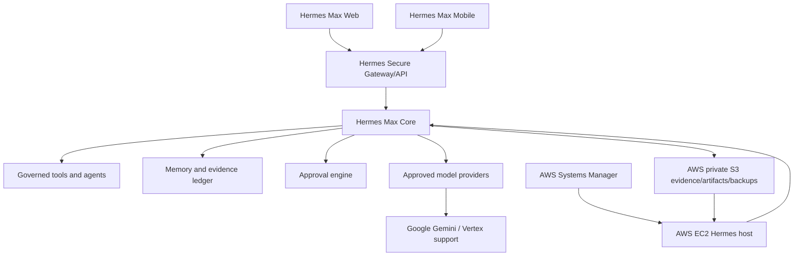

# Hermes Max Cloud Architecture

Hermes Max uses AWS as the primary production cloud and Google Cloud only for
bounded support workloads. Google Cloud must not run a second Hermes brain.

## Foundation vs application boundary

The repository currently contains a deployable **cloud foundation** and Hermes
runtime/workflow code. The foundation provisions a verified host, private
storage, budget guards, workload identity, release delivery, and recovery path.

The documented Hermes Secure Gateway API is an application boundary, not an IaC
resource. Do not report the gateway as live until an actual authenticated gateway
service is installed and `/api/v1/health` is tested.

## Intended gateway contract

- `GET /api/v1/health`
- `POST /api/v1/chat`
- `/api/v1/runs`
- `/api/v1/tasks`
- `/api/v1/agents`
- `/api/v1/skills`
- `/api/v1/memory`
- `/api/v1/approvals`
- `/api/v1/evidence`
- `/api/v1/providers`
- `/api/v1/devices`

Streaming should use WebSocket or SSE. Clients must not embed privileged Hermes
logic.

## Security model

Server-side authorization must preserve:

- actor identity;
- device;
- agent;
- tool;
- data class;
- action.

Classification boundaries, approvals, proof-before-success, evidence provenance,
canary promotion, rollback, and privileged routing remain server-side concerns.

The initial AWS host uses:

- no inbound SSH;
- SSM Session Manager;
- IMDSv2 required;
- encrypted root storage;
- least-privilege S3 role;
- checksummed release bootstrap;
- private/versioned artifact and evidence stores.

## Explicit non-goals

No Kubernetes, GPUs, RDS, NAT Gateway, active-active multi-cloud, Oracle Cloud,
reserved capacity, paid support plan, or domain purchase is part of the initial
foundation.
