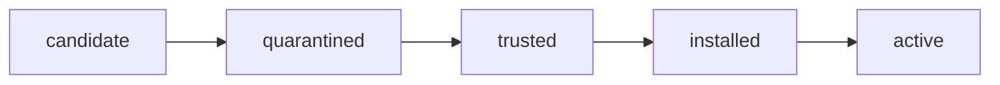

# Hermes Trust Gate

The Trust Gate is the promotion boundary for every external skill, MCP server,
package, model artifact, and external capability.

Discovery tools such as Scout, Agent Reach, external-source-sweep, GitHub, Reddit,
arXiv, videos, or forums can produce candidates. They cannot promote candidates.

## State Machine



The driver emits a recommended next state but does not install or activate the
candidate.

## Commands

```bash
src/system/trust-gate.sh status
src/system/trust-gate.sh scan .agents/skills/video-watch --type skill
src/system/trust-gate.sh scan https://github.com/example/repo --type mcp
src/system/trust-gate.sh scan ./model.gguf --type model
```

Set `HERMES_TRUST_GATE_SECRET` to sign artifacts with HMAC-SHA256. Without it,
reports still include a canonical SHA256 payload signature.

## What It Checks

- repository metadata and latest commit identity
- package files and install hooks
- binary/archive/model artifacts
- credential-access and secret-request patterns
- prompt/instruction injection patterns
- persistence, stealth, network-exfiltration, public-scanning, exploit terms
- MCP write/send/delete/shell/browser-profile surfaces
- license file presence
- file hashes for reproducible review

## Boundaries

- No candidate code execution.
- No installer execution.
- No daemon start.
- No MCP config writes.
- No secrets passed to candidates.
- No activation from Scout/Agent Reach discovery alone.

Human approval remains required for runtime promotion, package installers,
browser-profile access, MCP config writes, secrets, posting/sending, deletion,
purchases, security settings, and credential entry.
