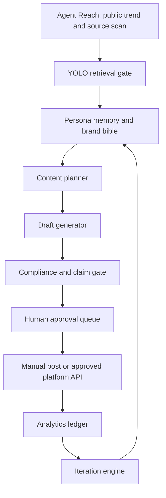

# Hermes Virtual Creator Revenue Blueprint

## Objective

Build a compliant, AI-disclosed virtual creator system that uses Hermes/JARVIS
to research trends, maintain persona memory, draft content, package offers,
queue posts, and analyze performance. The system copies the useful funnel
architecture from the X playbooks, but rejects the deceptive claim that the
persona should look real while hiding that it is AI-generated.

## Non-Negotiable Boundaries

- The creator is disclosed as AI-generated wherever the platform requires or
  where a reasonable user could be misled.
- No stolen likenesses, celebrity lookalikes, private-person mimicry, or
  deepfake use.
- No automated DMs pretending to be human.
- Hermes may draft, research, score, schedule, and report.
- Hermes/JARVIS must require human approval before posting, sending messages,
  deleting content, buying tools, entering credentials, changing account
  settings, or granting new permissions.
- Revenue screenshots, income claims, and case-study claims must be treated as
  unverified unless backed by platform analytics and payout records.

## Architecture



## Core System Modules

| Module | Purpose | Inputs | Outputs | Gate |
|---|---|---|---|---|
| `trend-scanner` | Finds current content angles and hooks. | X-indexed web, Reddit, Instagram observations, YouTube, GitHub/tools, niche keywords. | Source-linked trend queue. | YOLO retrieval gate allowed. |
| `persona-memory` | Stores the virtual creator's consistent identity. | Brand bible, visual rules, audience, boundaries, past posts. | Persona state JSON and reusable prompt context. | Local write allowed; no public action. |
| `content-planner` | Builds weekly content calendar. | Trend queue, persona memory, monetization goals. | Calendar with post concepts, hooks, asset needs. | Draft gate allowed. |
| `asset-brief-generator` | Converts concepts into image/video prompts. | Calendar item, visual identity, platform format. | Prompt pack for image/video tools. | Draft gate allowed. |
| `caption-and-script-drafter` | Writes captions, short scripts, CTAs. | Asset brief, target platform, tone. | Draft captions/scripts. | Draft gate allowed. |
| `compliance-checker` | Checks AI disclosure, claims, likeness, and platform risk. | Drafts and media metadata. | Pass/fail and required edits. | Must pass before queue. |
| `approval-queue` | Holds all post/send/account actions for human approval. | Final drafts and risk notes. | Approved, rejected, or revise decision. | Human only. |
| `analytics-ledger` | Tracks performance and revenue signals. | Post metrics, clicks, replies, sales, costs. | JSONL/CSV performance ledger. | Read/write local only. |
| `iteration-engine` | Decides what to repeat, stop, or test. | Analytics ledger and trend queue. | Next experiments. | YOLO retrieval gate for research only. |

## Data Model

Create this as `config/virtual-creator-profile.example.json` when implemented:

```json
{
  "id": "virtual_creator_001",
  "name": "Example AI Creator",
  "disclosure": "AI-generated virtual creator",
  "niche": "business automation for local service owners",
  "audience": [
    "small business owners",
    "solo operators",
    "service providers"
  ],
  "voice": {
    "tone": "direct, useful, optimistic but not hype",
    "avoid": ["fake income claims", "romantic deception", "spammy urgency"]
  },
  "visual_identity": {
    "style": "consistent, clean, non-photorealistic enough to avoid deception",
    "palette": ["black", "white", "electric blue"],
    "watermark": "AI-generated"
  },
  "allowed_platforms": ["instagram", "x", "youtube_shorts", "reddit_read_only"],
  "monetization": {
    "primary_offer": "AI-assisted lead capture and follow-up system setup",
    "secondary_offer": "digital templates and automation audits",
    "prohibited": ["undisclosed synthetic adult persona", "fake human relationship claims"]
  },
  "approval_policy": {
    "drafts": "model_allowed",
    "retrieval": "yolo_allowed",
    "post_send_delete_account": "human_required"
  }
}
```

## Hermes Skills To Add

### `virtual-creator-trend-scanner`

Scans public sources for content trends and competitor patterns.

Required behavior:

- Use Agent Reach or public web search.
- Save source links and confidence.
- Never scrape private sessions without explicit approval.
- Never post, like, follow, or message.

Output:

```json
{
  "trend": "missed-call automation for home service businesses",
  "source_url": "https://...",
  "platform": "reddit",
  "evidence": "short sanitized excerpt",
  "fit_score": 8,
  "risk": "low",
  "next_content_angle": "show the cost of missed leads"
}
```

### `virtual-creator-content-planner`

Turns trend findings into a weekly content calendar.

Required behavior:

- Use persona profile.
- Maintain 70/20/10 mix:
  - 70 percent useful content
  - 20 percent proof/process content
  - 10 percent direct offer content
- Include AI disclosure note if content uses synthetic persona media.

### `virtual-creator-asset-brief`

Creates prompts for image/video tools.

Required behavior:

- No real-person likeness mimicry.
- No celebrity lookalike prompts.
- No "make it indistinguishable from a real person" instructions.
- Prefer stylized, brand-safe, consistent identity.

### `virtual-creator-compliance-check`

Blocks deceptive or platform-risky content before approval.

Checks:

- AI disclosure present.
- No fake income claims.
- No hidden synthetic identity.
- No misleading personal availability.
- No stolen likeness.
- No unsupported product/service claims.
- No adult-content evasion language.

### `virtual-creator-analytics`

Tracks what happened after posting.

Fields:

```json
{
  "ts": "2026-08-06T00:00:00Z",
  "platform": "instagram",
  "post_id": "manual-or-platform-id",
  "topic": "missed lead follow-up",
  "format": "reel",
  "views": 0,
  "likes": 0,
  "comments": 0,
  "saves": 0,
  "profile_clicks": 0,
  "link_clicks": 0,
  "leads": 0,
  "sales": 0,
  "cost_usd": 0,
  "notes": "manual entry or API import"
}
```

## Gate Policy

Use the existing YOLO retrieval gate only for collection and research:

```bash
export HERMES_YOLO_MODE=retrieval
src/system/yolo-gate.sh check "scan public sources for virtual creator content trends"
```

Recommended approver chain:

```bash
export HERMES_YOLO_APPROVER_CHAIN="9router:openai/sol-5.6,9router:fable/fable-5,9router:moonshotai/kimi-k3,9router:kimi/kimi-latest,omniroute:nvidia/glm-5.2,nvidia:glm-5.2,onith:onith-1.0"
```

Human-only actions:

- publish post
- send DM
- reply as the creator
- delete content
- buy tools/ads
- change account settings
- enter credentials
- grant permissions
- connect payment accounts

## Exact Runtime Flow

### Daily

```bash
src/system/agent-reach.sh doctor
src/system/yolo-gate.sh check "scan GitHub, Reddit, X-indexed threads, Instagram policy updates, and creator economy sources"
src/system/revenue-ops.sh scan --profile virtual-creator
src/system/revenue-ops.sh package --profile virtual-creator
src/system/revenue-ops.sh report --profile virtual-creator
```

### Weekly

```bash
src/system/revenue-ops.sh content-calendar --profile virtual-creator --days 7
src/system/revenue-ops.sh compliance-check --profile virtual-creator --file path/to/draft.txt
src/system/revenue-ops.sh analytics --profile virtual-creator --platform instagram --topic "manual entry" --format reel --views 0
```

`revenue-ops.sh` is implemented as a report-first local driver. It can scan,
package, create calendars, run compliance checks, append analytics, and produce
status reports. It does not include send, post, delete, purchase, credential,
permission, or account-setting commands.

## Content System

### Pillars

| Pillar | Purpose | Example |
|---|---|---|
| Problem awareness | Shows painful business problems. | "How many quote requests never get a follow-up?" |
| Process proof | Shows how automation solves it. | "A 3-step missed-lead recovery flow." |
| Founder/operator POV | Makes the brand feel useful. | "What I would automate first in a cleaning business." |
| Tool breakdowns | Builds authority. | "Simple CRM + SMS + Gmail follow-up stack." |
| Offer posts | Converts demand. | "I set this up for service businesses." |

### Weekly Mix

| Day | Format | Pillar | CTA |
|---|---|---|---|
| Monday | Reel/short | Problem awareness | Comment keyword |
| Tuesday | Carousel/thread | Tool breakdown | Save/share |
| Wednesday | Short video | Process proof | Ask for audit |
| Thursday | Text post | Founder/operator POV | Reply with niche |
| Friday | Reel/short | Offer post | Book call or DM |
| Saturday | Story/post | Behind the scenes | Poll |
| Sunday | Report post | Lessons learned | Join list |

## Prompt Pack

### Trend Scanner Prompt

```text
You are Hermes trend scanner. Collect public source-linked content opportunities
for an AI-disclosed virtual creator in the niche: {{niche}}.

Return JSON only:
- trend
- source_url
- platform
- evidence_excerpt_under_200_chars
- audience_pain
- content_angle
- fit_score_1_to_10
- risk_low_medium_high
- why_now

Do not recommend deceptive synthetic identity tactics.
Do not include secrets, private data, or unsourced claims.
```

### Content Planner Prompt

```text
You are Hermes content planner. Build a 7-day content calendar for the
AI-disclosed virtual creator profile below.

Profile:
{{profile_json}}

Trend queue:
{{trend_queue_json}}

Rules:
- 70 percent useful, 20 percent proof/process, 10 percent offer.
- Include AI disclosure where synthetic media appears.
- No fake income claims.
- No implied real-person relationship.
- No posting. Draft only.

Return a markdown table and JSON calendar.
```

### Compliance Checker Prompt

```text
You are the Hermes virtual creator compliance checker.

Review this draft:
{{draft}}

Return:
- decision: pass / revise / block
- reasons
- required_changes
- disclosure_status
- unsupported_claims
- likeness_or_deception_risk
- approval_required: always true for posting/sending

Block if the content hides that the creator is AI-generated, mimics a real
person, uses unsupported earnings claims, or implies personal availability that
is not real.
```

## Monetization Plan

Primary compliant offer:

> AI-assisted lead capture and follow-up system setup for local service
> businesses.

Why this offer:

- It matches the revenue-source scan finding that small businesses buy outcomes,
  not "AI automation."
- It lets the virtual creator be a marketing character for a real service.
- It avoids the highest-risk fake-relationship and adult-content angle.

Offer ladder:

| Tier | Price | Deliverable |
|---|---:|---|
| Audit | 97 | Review current lead follow-up and missed inquiry points. |
| Setup Lite | 497 | One lead form, one inbox rule, one follow-up sequence, one dashboard. |
| Setup Pro | 1500 | CRM pipeline, Gmail/SMS drafts, quote follow-up, analytics report. |
| Retainer | 500/month | Weekly optimization and reporting. |

## Metrics

Track weekly:

- posts published
- views
- saves
- comments
- profile clicks
- link clicks
- qualified leads
- calls booked
- proposals sent
- closed revenue
- content cost
- tool/API cost
- time spent

Kill criteria:

- 30 posts with no profile clicks
- 1000 profile visits with no qualified leads
- 20 qualified leads with no booked calls
- CAC or labor cost exceeds expected first-order revenue

## 30-Day Launch Plan

### Days 1-3: Foundation

- Create persona profile JSON.
- Create content pillars.
- Create compliance checker.
- Create analytics ledger.
- Generate first 20 content ideas.

### Days 4-7: Asset and Draft Sprint

- Draft 10 posts.
- Generate 5 visual asset briefs.
- Run compliance checks.
- Manually approve and post first 3-5 items.

### Days 8-14: First Feedback Loop

- Track analytics daily.
- Identify top two content pillars.
- Draft one offer page.
- Draft one lead magnet.
- Start manual outreach only where allowed and approved.

### Days 15-21: Offer Conversion

- Publish proof/process posts.
- Package audit offer.
- Create booking or intake form.
- Draft replies to inbound messages.
- Human approves all replies.

### Days 22-30: Scale What Works

- Double down on top performing content format.
- Create second lead magnet or case-study-style walkthrough.
- Start weekly analytics report.
- Decide whether to add API posting or keep manual posting.

## Accuracy Assessment Of X Claims

The X claims are not reliable enough to copy as evidence. Treat them as funnel
ideas only.

| Claim | Assessment |
|---|---|
| "$3,000-$50,000/month" | Possible for rare winners; not proven by snippets. |
| "Almost automatic" | Misleading. Creative direction, QA, approvals, and analytics still require work. |
| "Looks 100% real" | High compliance and deception risk. Do not use this as a goal. |
| "Runs Instagram account" | Feasible with drafts/manual posting; automated posting depends on platform API and policy. |

## Implementation Files To Add Next

| File | Purpose |
|---|---|
| `config/virtual-creator-profile.example.json` | Persona and policy profile. |
| `.agents/skills/virtual-creator-trend-scanner/SKILL.md` | Research skill. |
| `.agents/skills/virtual-creator-content-planner/SKILL.md` | Calendar skill. |
| `.agents/skills/virtual-creator-asset-brief/SKILL.md` | Media prompt skill. |
| `.agents/skills/virtual-creator-compliance-check/SKILL.md` | Risk gate skill. |
| `.agents/skills/virtual-creator-analytics/SKILL.md` | Metrics skill. |
| `src/system/revenue-ops.sh` | Driver CLI. |
| `tests/test_virtual_creator_policy.sh` | Boundary tests. |
| `promptfoo/evals/virtual-creator-policy.yaml` | Prompt/policy eval. |

## Acceptance Criteria

- Retrieval/source expansion can continue through YOLO mode.
- All generated public content goes through compliance check.
- All post/send/delete/account actions require human approval.
- Analytics are stored locally before any external dashboard integration.
- The system can produce a 7-day calendar, 10 post drafts, 5 asset briefs, and
  one offer page without connecting any private platform session.
